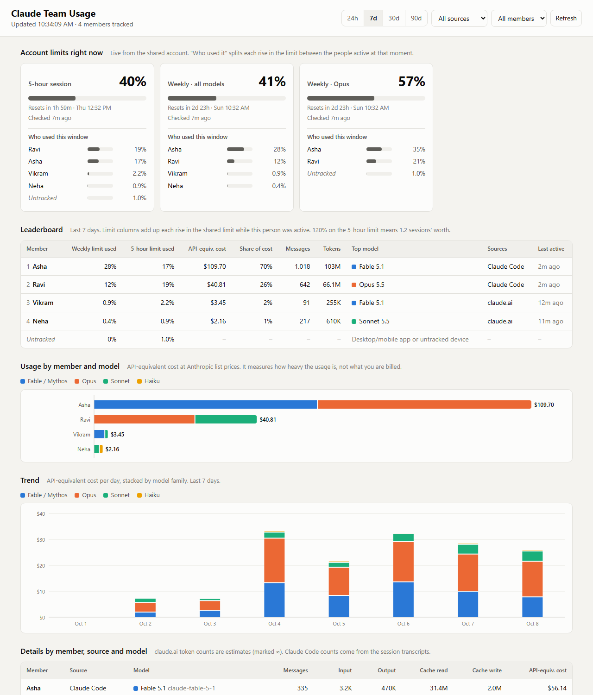

# Claude Team Usage

See who on your team is using up the shared Claude limit, and on which model.

It covers both places your team uses Claude:

- **Claude Code** in the terminal and in VS Code, through a hook that reads the local session transcripts.
- **claude.ai** in Chrome, through a small extension.

Everything lands on one small server with a dashboard.



## What you get

- **Live account limits.** The 5-hour session, weekly, and per-model weekly windows, with reset times.
- **Who used each window.** Every rise in the limit is split between the people who were active at that moment.
- **Leaderboard.** Per person: weekly and 5-hour limit used, API-equivalent cost, messages, tokens, top model, last active.
- **Usage by member and model**, a daily or hourly trend, and a detailed table.
- **App split.** VS Code, the Claude Code CLI and claude.ai are counted separately.
- **Manager tools.** Alerts when one person takes a big share of the limit in a day or a limit runs high, renaming and merging members, and downloads for Excel.
- **Extension popup.** Click the toolbar icon to see your own usage today and over 7 days, by app and model.

No npm dependencies anywhere. The server uses Node's built-in `http` and `sqlite`.

## How it works

```
 Claude Code (CLI / VS Code)          claude.ai in Chrome
   Stop hook -> report.js               extension (content script)
   - new tokens from transcripts        - model + response size per message
   - plan limit % (oauth/usage)         - plan limit % (claude.ai usage)
              \                          /
               \      HTTPS + token     /
                v                      v
              Team server (Node + SQLite)  ->  Dashboard
```

Each teammate's hook and extension tag their data with that person's name. The limit percentages are account-wide, so the server works out each person's share. When the limit goes up between two snapshots, the rise is credited to whoever was active in that interval, weighted by their API-equivalent cost. A rise with no tracked activity shows as **Untracked**. That is usually the Claude desktop or mobile app, or someone without the tracker installed.

## Setup

You need Node.js 22.13 or newer on the server and on each teammate's machine. Node 24 is recommended.

### 1. Run the server (once, by the admin)

Pick a machine that every teammate can reach: a small VPS, or an always-on office PC on the LAN.

**On Windows:** double-click `start-server.cmd`. Keep the window open.

**Anywhere else:**

```bash
cd server
node src/index.js            # listens on http://0.0.0.0:8787
```

On the first start the server creates `server/.env` with two new tokens and prints them:

- **`TEAM_TOKEN`** goes to every teammate. Their Claude Code hook and Chrome extension use it to send usage. It cannot open the dashboard.
- **`DASHBOARD_TOKEN`** is for the manager only. It opens the dashboard and the admin tools.

To see them again later, open `server/.env` in a text editor.

A `server/.env` made by an older version has only `TEAM_TOKEN`. Then the team token opens the dashboard and the admin tools are off. To turn them on, generate a token with `node -e "console.log(require('crypto').randomBytes(24).toString('base64url'))"`, add it to `server/.env` as a `DASHBOARD_TOKEN=...` line, and restart the server.

**With Docker:** generate two tokens with the command above, then:

```bash
cp .env.example .env         # put the tokens in TEAM_TOKEN and DASHBOARD_TOKEN
docker compose up -d
```

Data is stored in `server/data/usage.db`, or in the `usage-data` volume with Docker.

If the server is reachable from the internet, put it behind HTTPS, for example with Caddy: `caddy reverse-proxy --from usage.example.com --to localhost:8787`. The token travels in a request header, so plain HTTP is only safe on a trusted LAN.

### 2. Claude Code hook (each teammate)

To hand the setup to your team, run `npm run pack-teammates -- --server http://YOUR-SERVER:8787` on the server PC. It writes `dist/claude-team-usage.zip` with the installer, the extension and a step-by-step `TEAMMATE-SETUP.txt` that already has your server address. The zip never contains the `server` folder, its `.env` tokens or the database. Send the team token separately.

Each teammate unzips it, or clones this repo. On Windows, double-click `install-claude-code-hook.cmd` and answer four questions: server address, team token, your name, and how many days of history to send. Anywhere else, or to skip the questions:

```bash
node claude-code-hook/install.js --server http://YOUR-SERVER:8787 --token TEAM_TOKEN --name yourname --backfill-days 30
```

On the server PC itself the address is `http://localhost:8787`. Everyone else uses the server's IP address, for example `http://192.168.1.10:8787`. The installer:

- copies the reporter to `~/.claude/team-usage/`,
- adds `Stop` and `SessionEnd` hooks to `~/.claude/settings.json` and keeps your other settings, with a backup in `settings.json.bak-team-usage`,
- sends the last 30 days of history and does a first sync.

It works for the CLI and the VS Code extension, because both use the same `~/.claude` folder. The hook returns at once and does its work in the background, so Claude Code never waits for it.

Check it any time:

```bash
node ~/.claude/team-usage/report.js --status
node ~/.claude/team-usage/report.js --now      # sync right now and print the result
```

Optional flags: `--no-limits` stops reading the plan percentage, and `--no-project-names` stops sending project folder names.

### 3. Chrome extension (each teammate)

1. Open `chrome://extensions` and turn on **Developer mode**.
2. Click **Load unpacked** and choose the `extension` folder of this repo.
3. The settings page opens. Enter the server address, the team token, and **the same name** used for the Claude Code installer.
4. Reload any open claude.ai tabs.

Click the toolbar icon to see:

- the shared account limits,
- your usage today and over the last 7 days, split by app (VS Code, Claude Code CLI, claude.ai) and by model,
- the team list for the last 7 days, only when the server has no separate `DASHBOARD_TOKEN`.

VS Code and CLI numbers reach the popup through the Claude Code hook from step 2. A browser extension cannot read files on your computer, so the hook is what carries them to the server.

A red `!` on the icon means it needs setup or the server is unreachable. Data is queued and sent once the server is back.

It also works in Edge, Brave and other Chromium browsers.

**Locking it for the whole company.** Anyone can switch off or remove an extension they loaded themselves. If your Chrome profiles are managed with Google Workspace, an admin can force-install the extension instead. People then cannot disable or remove it, the server address and token come from the policy, and each person's name comes from their work email (`memberFromEmail`), so nobody can report as someone else. The settings page shows those fields as set by the company. [docs/it-lock.md](docs/it-lock.md) has the steps for the admin. `npm run pack-extension` builds the zip for the Chrome Web Store in `dist/`.

### 4. Open the dashboard

Go to `http://YOUR-SERVER:8787` and enter the dashboard token. A link of the form `http://YOUR-SERVER:8787/#token=...` signs in directly. The part after `#` never reaches the server.

### 5. Manager tools

These need a separate `DASHBOARD_TOKEN`, so the team token every teammate has can never change or delete data.

- **Alerts** at the top of the dashboard. A warning shows when one person used a big share of the weekly limit in the last 24 hours (15 points by default: at that pace one person alone would use up the whole team's week), when the same happens with nobody tracked active, or when an account limit reaches 80%. Change both levels under **Manage team**.
- **Manage team** button. **Rename** fixes a spelling, or merges two names of the same person when you pick a name that already exists. The old name keeps working, so nobody has to change their setup. **Delete** removes everything a member sent, limit readings included. It cannot be undone, and if that person still has the tracker installed, new usage shows up again.
- **Download for Excel** on the leaderboard and on the details table. Both use the range and filters on the page and give one row per day: by member with their share of the limit, or by member, app and model with tokens and cost.

## Reading the numbers

- **Weekly limit used / 5-hour limit used.** Percentage points of the shared limit credited to that person in the selected range. Over several days the 5-hour column can pass 100%: 250% means two and a half sessions' worth.
- **API-equivalent cost.** Tokens priced at Anthropic's public API rates. A subscription is not billed this way. It is the fairest single measure of how heavy someone's usage is, because a reply from a bigger model costs more limit.
- **≈ estimates.** claude.ai does not show token counts, so the extension estimates them from text length at about 4 characters per token. Claude Code counts are exact, from the transcripts.

The split is approximate when two people use Claude in the same minute. Over a day or a week it evens out. It also relies on each machine's clock being roughly right.

## Privacy

Sent to your server:

- your name, the model, token counts, timestamps,
- the session ID, and the project folder name unless you turn it off,
- the plan's limit percentages.

Never sent:

- prompts, replies, file contents, or code,
- login tokens. The Claude Code hook reads your Claude login only to ask `api.anthropic.com` for the limit percentage. The token goes nowhere else. The extension uses claude.ai's own session in the page and never reads cookies.

## Troubleshooting

| Problem | What to check |
|---|---|
| Teammate missing from the dashboard | Run `report.js --status` on their machine and look at the recent log lines. |
| `limit snapshot skipped` in the log | Claude Code on that machine is logged in with an API key, not a Claude subscription. Usage still counts; only the limit percentage comes from someone else. |
| Extension shows `!` | Open its settings and press **Test connection**. |
| Lots of **Untracked** | Someone uses Claude without the tracker, or uses the desktop or mobile app. |
| Hook never runs on Windows | Make sure `node --version` works in a new terminal, then run the installer again. |

## Uninstall

```bash
node claude-code-hook/uninstall.js           # remove the hooks
node claude-code-hook/uninstall.js --purge   # also delete ~/.claude/team-usage
```

Remove the extension from `chrome://extensions`.

## Limitations

- The limit percentages come from the internal endpoints that claude.ai and Claude Code use to show plan usage. They are not a documented public API and may change. If they do, token tracking keeps working and only the limit columns stop updating.
- Claude desktop and mobile apps cannot be tracked.
- Limit readings are taken only when a tracked person uses Claude. Usage from an untracked app or device shows as **Untracked** only if nobody tracked was active between two readings. Otherwise it is credited to whoever was.
- The server assumes everyone shares one Claude account. With separate seats on a Team plan, use the admin console's built-in analytics instead.

## Not affiliated with Anthropic

This is an independent project. It is not made, endorsed or supported by Anthropic. Claude is a trademark of Anthropic.

Read Anthropic's terms before you share one subscription between several people. Anthropic's Team and Enterprise plans are made for teams and have usage analytics built in.

## Development

```bash
npm test                                   # 53 tests, includes an end-to-end install and sync
node server/scripts/seed-demo.js data/demo.db
DB_PATH=data/demo.db TEAM_TOKEN=demo-token-123456 node server/src/index.js
node claude-code-hook/report.js --dry-run --days 7   # parse your own transcripts, send nothing
```

Layout:

```
server/            HTTP API, SQLite store, limit attribution, dashboard (public/)
claude-code-hook/  installer, reporter, transcript scanner
extension/         Chrome MV3 extension
scripts/           zips for teammates and for the Chrome Web Store
docs/              screenshots and the Chrome policy guide for admins
```

## License

MIT, copyright (c) 2026 Naman Gupta. See [LICENSE](LICENSE).
